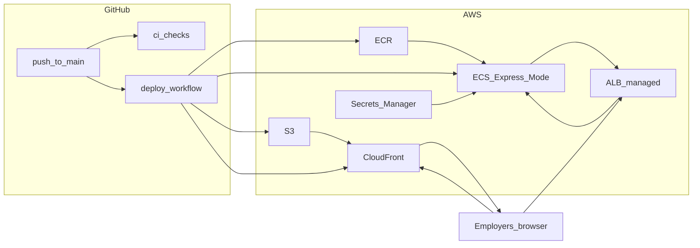

# Incremental AWS demo build (reference)

Snapshot of the incremental build plan for the employer-facing static site, ECS Express API, IaC, and GitHub deploy pipeline. Saved under `planning/` for long-term reference.

---

# Incremental build: employer demo on AWS (static site + API via ECS Express Mode)

## Context from this repo

- The product today is a **Python CLI** ([`app.py`](../app.py)) calling [`run_agent`](../src/carbon_intensity/agent.py); there is **no HTTP layer**, **no Dockerfile**, and **no AWS** code yet.
- CI already runs on **`main` and PRs** via [`.github/workflows/ci.yml`](../.github/workflows/ci.yml) (uv, pre-commit, pytest).

**Architecture choices (updated):**

- **Employer-facing UI**: a **static page** (plain HTML/CSS, optionally a small set of assets)—**no chat UI** and no JavaScript-heavy SPA requirement.
- **API hosting**: **[Amazon ECS Express Mode](https://docs.aws.amazon.com/AmazonECS/latest/developerguide/express-service-overview.html)**—ECS provisions **Fargate**, **Application Load Balancer** (shared across Express services in the account/region per AWS behavior), monitoring, and an AWS-provided URL—without hand-rolling every ECS+ALB primitive yourself. **Do not use App Runner** in this plan (and avoid presenting App Runner as an alternative).
- **Why not API Gateway + Lambda for the agent API**: synchronous integrations are **~30s capped**; the agent can run longer tool loops, so **long-lived HTTP to a container** (Express/Fargate behind ALB) fits better.

### Static pages, crawlers, and “refresh every 6 hours”

- **Reloading the static page does not reinvoke your API** by default. S3+CloudFront serves **HTML/CSS/assets**; each reload is just another `GET` for those objects. **No Anthropic call** happens unless you add **client-side JavaScript** that calls the API on `load`—avoid that on the public marketing page.
- **Bots crawling the site** hit CloudFront/S3 the same way: static files only, **not** your container, unless they discover and hammer a **separate public API URL** you linked (e.g. `/api/chat`). If you expose an interactive chat API on the internet, protect it (auth, WAF, rate limits, or keep it off the public internet) rather than relying on “no one will find it.”
- **Updating demo content on a schedule (e.g. every 6 hours)** should be **decoupled from page views**: run a **scheduled job** (e.g. **Amazon EventBridge** rule `rate(6 hours)` or a cron) that invokes a **short-lived task** (ECS scheduled task on Fargate, Lambda if it fits) which calls your existing carbon/API logic (or a **single** `run_agent` run if you truly want copy refreshed that way), then **writes the result into S3** next to the static site—for example `snapshot.json` or a regenerated snippet—and optionally **invalidates only that path** in CloudFront. The static `index.html` can reference `./snapshot.json` with **no JS polling**; browsers and bots only see new text after the next scheduled upload + cache behavior you define.

---

## Phase A — Application: API and static site (no AWS yet)

**1. Add a small HTTP API (FastAPI or similar)**

- New module (e.g. `src/carbon_intensity/web/` or top-level `api/`) exposing:
  - `GET /health` (or `/healthz`) for load balancer checks
  - `POST /api/chat` (or similar) with JSON body `{ "message": "..." }` returning `{ "reply": "..." }` by calling existing `run_agent` (for API clients, scripts, or future use—not required to be called from the static page)
- Read `ANTHROPIC_API_KEY` (and optional `ANTHROPIC_MODEL`) from the environment only; do not bake secrets into images.
- **CORS**: still useful if you later add a form or tools hitting the API; if the static page is purely informational, CORS can stay permissive for your CloudFront origin or be tightened later.

**2. Add automated tests for the API**

- Use Starlette/FastAPI `TestClient` in [`tests/`](../tests/) for `/health` and a mocked `run_agent` (or dependency override) so CI stays deterministic and fast.

**3. Add a static demo page**

- New directory (e.g. `site/` or `public/`) with **`index.html`** plus optional CSS/images: project summary, what the agent does, links to this repo. **Do not** add scripts that call the LLM API on every page load; if you show “live” numbers, load them from a **precomputed** `snapshot.json` (or static HTML) produced by the **scheduled** pipeline below—not from the ECS API on each visit.
- **No chat UI**—no embedded chat widget, no Vite/React requirement. If you prefer zero Node in the repo, ship hand-authored HTML/CSS only.

**4. Deploy artifacts**

- Static: upload the folder as-is to S3 (no `npm run build` unless you voluntarily add a static site generator later).
- API: container image pushed to ECR and deployed to **ECS Express Mode**.

---

## Phase B — Container for the API

**5. Dockerfile for the API**

- Install with **uv** (respecting [`uv.lock`](../uv.lock)), copy `src/` + [`pyproject.toml`](../pyproject.toml), run **uvicorn** on `0.0.0.0:8000`.
- Add `.dockerignore` to keep images small.

**6. Local smoke: `docker run`**

- Verify `/health` and the agent endpoint with a dev key (not committed).

---

## Phase C — IaC foundation (pick one tool and stay consistent)

**7. Create an `infra/` tree** (Terraform example): `versions.tf`, `providers.tf`, `variables.tf`, `outputs.tf`, optional `modules/` for `ecs_express_api`, `static_site`, `github_oidc`.

- **ECS Express Mode** is supported via AWS APIs and IaC (e.g. CloudFormation/CDK/Terraform resources for Express services—align module names with the provider resources available for your chosen tool version). See [Express Mode service resources](https://docs.aws.amazon.com/AmazonECS/latest/developerguide/express-service-work.html).

**8. Remote state (recommended)**

- S3 backend for Terraform state + DynamoDB table for locking (bootstrap documented in-repo only if you add a short note you asked for).

---

## Phase D — AWS: API (ECR + ECS Express Mode)

**9. ECR repository**

- IaC defines the repo; CI pushes `:main` / `:git-sha` tags.

**10. ECS Express Mode service**

- Define the Express Mode ECS service pointing at your container image and port (e.g. 8000), task execution role, and infrastructure role per AWS requirements. Express Mode creates/manages the **ALB**, **Fargate** tasks, security groups, and related wiring as described in the [Express overview](https://docs.aws.amazon.com/AmazonECS/latest/developerguide/express-service-overview.html)—prefer this over a fully manual ECS+ALB Terraform module unless you need low-level control.

**11. Secrets**

- Store `ANTHROPIC_API_KEY` in **Secrets Manager** (or SSM); inject into the task; **no key in GitHub** except via OIDC for deployment.

**12. Outputs**

- Export the **Express-provided public URL / DNS** (and ECR URI) for docs and optional links from the static page.

---

## Phase E — AWS: Static site (S3 + CloudFront)

**13. Private S3 bucket for static assets**

- Bucket policy allowing **CloudFront OAC** only.

**14. CloudFront distribution**

- Origin = S3; **default root object** `index.html`. Skip SPA-style error routing unless you add client-side routes later.

**15. Cache invalidation**

- On deploy, invalidate `/*` or specific paths. For **scheduled snapshot** updates, invalidate only `snapshot.json` (or similar) to limit churn and cost.

---

## Phase E2 — Optional: scheduled refresh (e.g. every 6 hours)

**15b. EventBridge schedule**

- Rule targeting an ECS **scheduled task** (same image as the API with a different command, or a smaller worker image) or Lambda: run the **data/agent job once**, write output to the **same S3 bucket** as the static site (`snapshot.json`, etc.).

**15c. IAM**

- Task role allows `s3:PutObject` on the site bucket prefix; no need for public internet to hit the long-running Express service for this content.

**15d. Cost and crawler safety**

- Crawler traffic stays on **CloudFront + S3**; **LLM/API work** scales with **schedule** (e.g. 4×/day), not with page views.

---

## Phase F — Continuous deployment from GitHub (`main`)

**16. GitHub OIDC → AWS IAM role**

- Trust policy scoped to this repo and branch `main`.
- Permissions: ECR push, **ECS Express / ECS service update** APIs needed for your deploy path, S3 sync, `cloudfront:CreateInvalidation` (and if using scheduled tasks, whatever EventBridge/ECS scheduling needs).

**17. New workflow: deploy on `main` only**

- **Trigger**: `on: push: branches: [main]`.
- **Jobs** (`needs:`): quality gate → build & push API image → IaC apply or service update → **sync static folder to S3** → **invalidate CloudFront**.
- No `VITE_*` variables unless you add a build step; for plain static files, sync is enough.

**18. Keep PR CI unchanged**

- [`.github/workflows/ci.yml`](../.github/workflows/ci.yml) remains for PRs; deploy workflow is **main-only**.

---

## Phase G — Hardening (optional)

**19. HTTPS and custom domain**

- ACM + Route 53 for CloudFront and/or the Express URL, per AWS guidance.

**20. Abuse controls**

- WAF, rate limits, optional protection on `/api/chat`.

**21. Observability**

- CloudWatch alarms on 5xx and task health (Express integrates with monitoring per AWS docs).

---

## IAM roles and permissions (what needs what)

Use **least privilege** in production: replace `Resource: "*"` with your ARNs (account id, region, cluster name, secret name, bucket name, distribution id).

### 1. GitHub Actions — OIDC deploy role (human: `repo:org/name:ref:refs/heads/main`)

**Trust policy**: `sts:AssumeRoleWithWebIdentity` for `token.actions.githubusercontent.com`, audience `sts.amazonaws.com`, condition on `sub` = allowed repo ref(s).

**Typical permissions** (combine what your workflow actually does):

| Area | Actions (representative) | Notes |
|------|-------------------------|--------|
| **ECR — push image** | `ecr:GetAuthorizationToken` (often on `*`); on the **repository ARN**: `ecr:BatchCheckLayerAvailability`, `ecr:CompleteLayerUpload`, `ecr:InitiateLayerUpload`, `ecr:PutImage`, `ecr:UploadLayerPart`, `ecr:BatchGetImage` | GetAuthorizationToken is account-wide in practice. |
| **ECS — new deployment** | `ecs:DescribeServices`, `ecs:UpdateService`, optionally `ecs:DescribeTaskDefinition`, `ecs:RegisterTaskDefinition` if the workflow registers tasks | Scope to cluster ARN + service ARN if possible. Express Mode still uses standard ECS APIs for deploy. |
| **S3 — static site** | `s3:PutObject`, `s3:DeleteObject`, `s3:ListBucket` on the **site bucket** prefix | For `aws s3 sync`. |
| **CloudFront** | `cloudfront:CreateInvalidation` on the **distribution ID** | Invalidation is per-distribution. |
| **IaC (Terraform in CI)** | Broad: often `iam:*`, `ecs:*`, `elasticloadbalancing:*`, `ec2:Describe*`, `ec2:CreateSecurityGroup`, … on scoped resources, or a **Terraform deploy role** with policies generated by IAM Policy Simulator / `terraform plan` review | If Terraform runs in GitHub, this role needs whatever your modules create (VPC pieces, ALB, ECS, ECR, S3, CloudFront, IAM roles for tasks). Alternatively run `terraform apply` from a trusted machine with a different role and keep GitHub image-only + `UpdateService`. |

**Why the policy picker shows nothing for `GetAuthorizationToken`:** The **Attach policies** search matches **policy names** (e.g. `AmazonEC2ContainerRegistryPowerUser`), not **IAM action** strings like `ecr:GetAuthorizationToken`. Those actions appear **inside** a policy’s JSON.

**What to attach or search for (GitHub deploy role):**

| Need | What to do in IAM |
|------|-------------------|
| **ECR** — `docker push` / `GetAuthorizationToken` and layer uploads | Attach AWS managed **`AmazonEC2ContainerRegistryPowerUser`** (search **ECR** or **ContainerRegistry**). It includes `ecr:GetAuthorizationToken` and push-related actions. |
| **ECS** — redeploy (`UpdateService`, describe) | No small managed “deploy-only” policy. Prefer an **inline policy** with `ecs:DescribeServices`, `ecs:UpdateService` (and task-definition APIs if your workflow needs them) scoped to your **cluster and service ARNs**. Sandbox only: **`AmazonECS_FullAccess`** is broad but easy. |
| **S3** — `aws s3 sync` | **Inline policy**: `s3:PutObject`, `s3:DeleteObject`, `s3:ListBucket` on your **bucket** ARN and `arn:aws:s3:::name/*`. |
| **CloudFront** — invalidation | **Inline policy**: `cloudfront:CreateInvalidation` on `arn:aws:cloudfront::ACCOUNT:distribution/DIST_ID`. |

**Confirm a managed policy contains an action:** IAM → **Policies** → search by **policy name** → open → **JSON** → search for `GetAuthorizationToken`.

**Least privilege:** Role → **Add permissions** → **Create inline policy** → **JSON** — paste `Statement`s using the **Action** names from the permission table above and **Resource** ARNs.

**Avoid** putting long-lived AWS keys in GitHub; OIDC only.

### 2. ECS **task execution role** (Fargate pulls image + logs + secrets injection)

Attach AWS managed **`AmazonECSTaskExecutionRolePolicy`** (covers ECR pull + CloudWatch Logs create/write).

**Secrets**: add inline or managed policy allowing `secretsmanager:GetSecretValue` (and **`kms:Decrypt`** if the secret uses a **customer-managed KMS** key) on the **specific secret ARN(s)** used in the task definition for env injection.

**No** need for this role to call Anthropic; that is app code using env vars at runtime.

### 3. ECS **task role** (your container at runtime)

- **API service**: often **empty or minimal** if the app only calls **public HTTPS** (Anthropic, carbon API) and does not use AWS APIs. If the app writes to S3, DynamoDB, etc., grant those actions here.
- **Scheduled snapshot task**: grant **`s3:PutObject`** (and optionally `s3:GetObject`, `s3:DeleteObject` if you replace objects) on **`arn:aws:s3:::your-bucket/prefix/*`**, plus **`kms:GenerateDataKey`** / `kms:Decrypt` if bucket uses SSE-KMS.

### 4. ECS Express Mode — **infrastructure role** (Express-managed resources)

Express Mode requires an **infrastructure IAM role** AWS uses to create/manage ALB, security groups, etc. **Do not invent permissions by hand**—follow the current **[Express Mode IAM documentation](https://docs.aws.amazon.com/AmazonECS/latest/developerguide/express-service-overview.html)** (AWS lists required trust + permissions; they can change with the feature). Your IaC attaches this role to the Express service as AWS specifies.

### 5. EventBridge → ECS scheduled task (optional Phase E2)

- **EventBridge** needs permission to **invoke** `ecs:RunTask` (often via an **IAM role** that EventBridge assumes to run the task).
- That role typically needs: `ecs:RunTask` on the task definition family, **`iam:PassRole`** for both **task execution** and **task** roles (scoped to those role ARNs), and optionally `ec2:Describe*` if using awsvpc networking details.

### 6. Terraform / bootstrap (one-time or CI)

- **S3 + DynamoDB** for remote state: role used for `terraform init/apply` needs `s3:*` on the state bucket and `dynamodb:GetItem`, `PutItem`, `DeleteItem` on the lock table.
- **Creating IAM roles** inside Terraform: the deploy principal needs `iam:CreateRole`, `iam:AttachRolePolicy`, `iam:PassRole` for roles Terraform creates (narrow `PassRole` to paths or role name prefixes).

### Quick mental model

- **GitHub OIDC role** = “CI can push ECR, roll ECS, sync S3, invalidate CF, and optionally apply IaC.”
- **Task execution role** = “Fargate agent can pull image, write logs, read Secrets Manager for env.”
- **Task role** = “My Python process can call AWS APIs (often none for API-only; S3 for snapshot worker).”
- **Express infrastructure role** = “ECS can create/manage load balancer plumbing per AWS’s Express contract.”

### How to create these in IAM (console-oriented)

**A. One-time: GitHub as an identity provider (OIDC)**

1. IAM → **Identity providers** → **Add provider** → **OpenID Connect**.
2. **Provider URL**: `https://token.actions.githubusercontent.com`
3. **Audience**: `sts.amazonaws.com` (AWS documents this for GitHub Actions).
4. Save. You only need this **once per account** (not per repo).

**B. IAM role for GitHub Actions (deploy role)**

**Preferred: start from Custom trust policy** (so you can pin `repo:…` and branch in one JSON blob):

1. IAM → **Roles** → **Create role**.
2. On **Step 1 — Select trusted entity**, look for **Custom trust policy** as a **trusted entity type** alongside options like *AWS account*, *AWS service*, *Web identity*, etc. Choose **Custom trust policy**, then paste the JSON block below into the editor.
3. If you **do not** see **Custom trust policy** on that first screen (UI varies by account/console version): use **Web identity** → provider `token.actions.githubusercontent.com`, audience `sts.amazonaws.com`, pick repo/org in the form **only to get past the wizard**, **finish creating the role**, then open the new role → **Trust relationships** tab → **Edit trust policy** and **replace** the JSON with the block below (this is the usual workaround).

**Custom trust policy JSON** (replace `ACCOUNT_ID`, `OWNER` = GitHub **username** or org, `REPO`; optional `sub` pattern restricts who can assume the role):

```json
{
  "Version": "2012-10-17",
  "Statement": [
    {
      "Effect": "Allow",
      "Principal": { "Federated": "arn:aws:iam::ACCOUNT_ID:oidc-provider/token.actions.githubusercontent.com" },
      "Action": "sts:AssumeRoleWithWebIdentity",
      "Condition": {
        "StringEquals": {
          "token.actions.githubusercontent.com:aud": "sts.amazonaws.com"
        },
        "StringLike": {
          "token.actions.githubusercontent.com:sub": "repo:OWNER/REPO:ref:refs/heads/main"
        }
      }
    }
  ]
}
```

4. **Attach policies**: start from **none**, then add **customer managed** or **inline** policies that match the table in §1 above (ECR, ECS, S3, CloudFront). For a first pass in a sandbox, some teams attach broader policies then **tighten ARNs** using Access Advisor / CloudTrail.
5. Name the role (e.g. `github-deploy-carbon-demo`) and copy the **role ARN** into GitHub Actions: `aws-actions/configure-aws-credentials` with `role-to-assume: <ARN>`.

**C. ECS task execution role**

1. IAM → **Roles** → **Create role** → trusted entity **AWS service** → **Elastic Container Service** → **Elastic Container Service Task**.
2. Attach **`AmazonECSTaskExecutionRolePolicy`**.
3. Add **inline policy** for `secretsmanager:GetSecretValue` (and KMS decrypt if needed) on your secret ARN.
4. Use this role ARN in the task definition as **Task execution role**.

**D. ECS task role (application)**

1. IAM → **Roles** → **Create role** → **Elastic Container Service** → **Elastic Container Service Task**.
2. Start with **no managed policies** if the app only calls the internet; attach **inline** `s3:PutObject` etc. for the snapshot worker if needed.
3. Reference this as **Task role** in the task definition.

**E. ECS Express infrastructure role**

- Create per **current AWS documentation** for Express Mode (trust + permissions are feature-specific). Often done inside **IaC** or the ECS console wizard when you create the Express service so you do not hand-author unknown actions.

**F. EventBridge → ECS (scheduled task) role**

- EventBridge will prompt for or create a role that can **run** your task; ensure that role has **`iam:PassRole`** for the execution and task role ARNs and **`ecs:RunTask`** on your task definition. The EventBridge console can create a starter role you then refine.

**G. Terraform in CI**

- Either grant the **same GitHub OIDC role** broad enough rights to create resources (hard to least-privilege upfront), or use a **separate** admin/bootstrap role on your laptop for `terraform apply` and keep GitHub to **image + deploy only** with a smaller policy.

---

## Dependency sketch



---

## Suggested PR sequence

| Step | Deliverable |
|------|-------------|
| PR1 | FastAPI + tests + env notes |
| PR2 | Static `site/` (HTML/CSS) + short dev notes |
| PR3 | Dockerfile + `.dockerignore` |
| PR4 | IaC: ECR + **ECS Express Mode** service + secrets + outputs |
| PR5 | IaC: S3 + CloudFront OAC |
| PR6 | GitHub OIDC + main-only deploy workflow |
| PR7+ | Custom domain, WAF, alarms |
| PR8 (optional) | EventBridge + scheduled task → S3 snapshot + minimal invalidation |

This order supports **local demo** after PR2–3, **API on AWS** after PR4, **full static + API** after PR6, and **crawler-safe scheduled refresh** when you add Phase E2.
